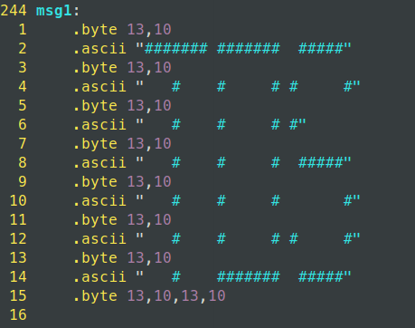
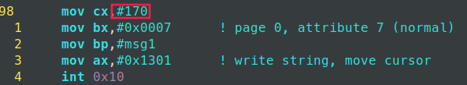
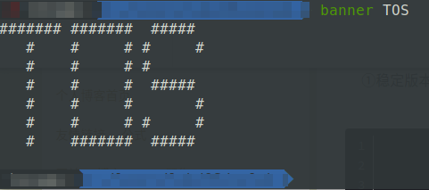
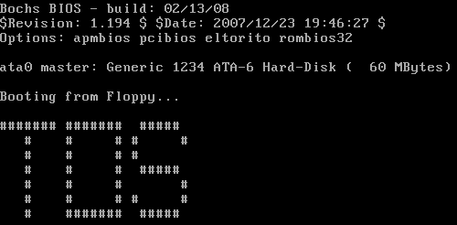
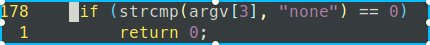
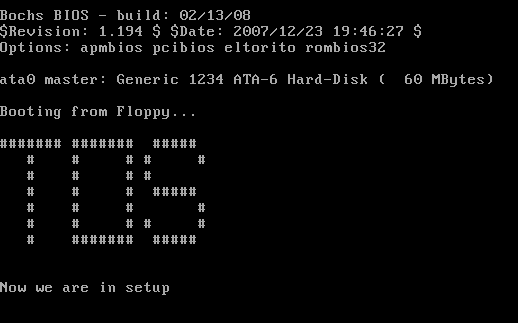
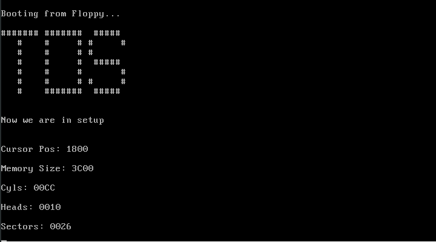
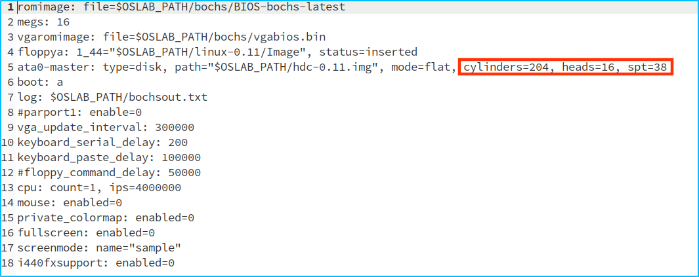

# 改写`bootsect.s`

> bootsect.s能在屏幕上打印一段提示信息“XXX is booting...”,其中XXX是你给自己的操作系统起的名字,例如LZJos、Sunix等(可以上论坛上秀秀谁的OS名字最帅,也可以显示一个特色logo,以表示自己操作系统的与众不同。)

很简单，修改下`msg1`这个段的显示文字：



然后再修改下`print`时的message长度即可：



特色的LOGO可以使用`banner`这个命令，将文字转成ASCII字符画。



至于这个长度怎么计算出来呢？当然不能一个一个数啦，这样不得累死。Linux中有个命令叫`wc`，可以计算字符个数，因此我们如下来计算字符个数：


8和16分别表示行数和字符数，`wc`命令统计的字符数包括换行符，但是这里换行符只是一个字节，因此这里我们要在160的基础上再加上一个8（Linux0.11内核中换行符用两个字节来表示），另外，最后再加上两个字节表示最后额外的一个换行符。所以，总共的字节数就是$160+8+2=170$。

实验结果：



# 改写`setup.s`

## 改写`setup.s`向屏幕输出一行"Now we are in SETUP"

> bootsect.s能完成setup.s的载入,并跳转到setup.s开始地址执行。而setup.s向屏幕输出一行"Now we are in SETUP"。

我们可以参照着`bootsect.s`中输出文字的代码自己写个`setup.s`，只需要修改下`es`中存储的段偏移地址即可：

```assembly
!
! SYS_SIZE is the number of clicks (16 bytes) to be loaded.
! 0x3000 is 0x30000 bytes = 196kB, more than enough for current
! versions of linux
!
SYSSIZE = 0x3000
!
!	bootsect.s		(C) 1991 Linus Torvalds
!
! bootsect.s is loaded at 0x7c00 by the bios-startup routines, and moves
! iself out of the way to address 0x90000, and jumps there.
!
! It then loads 'setup' directly after itself (0x90200), and the system
! at 0x10000, using BIOS interrupts. 
!
! NOTE! currently system is at most 8*65536 bytes long. This should be no
! problem, even in the future. I want to keep it simple. This 512 kB
! kernel size should be enough, especially as this doesn't contain the
! buffer cache as in minix
!
! The loader has been made as simple as possible, and continuos
! read errors will result in a unbreakable loop. Reboot by hand. It
! loads pretty fast by getting whole sectors at a time whenever possible.

.globl begtext, begdata, begbss, endtext, enddata, endbss
.text
begtext:
.data
begdata:
.bss
begbss:
.text

SETUPSEG = 0x9020			! setup starts here

entry _start
_start:
	mov ax, #SETUPSEG   ! 修改这里就行
	mov es, ax
	! Print some inane message
	mov	ah,#0x03		! read cursor pos
	xor	bh,bh
	int	0x10
	
	mov	cx,#25
	mov	bx,#0x0007		! page 0, attribute 7 (normal)
	mov	bp,#msg1
	mov	ax,#0x1301		! write string, move cursor
	int	0x10
	
msg1:
	.byte 13,10
	.ascii "Now we are in setup"
	.byte 13,10,13,10

.text
endtext:
.data
enddata:
.bss
endbss:
```

然后为了使用`make`编译，我们修改下build.c，当第三个参数为`"none"`的时候直接返回即可：



最后使用`make BootImage`命令编译，运行：



## 改写`setup.s`输出硬件参数

> setup.s能获取至少一个基本的硬件参数(如内存参数、显卡参数、硬盘参数等),将其存放在内存的特定地址,并输出到屏幕上。

根据实验手册，我们先写出获取光标位置、扩展内存大小以及磁盘参数表的代码。照抄实验手册即可，这里不再给出。然后按照实验手册上的提示写出打印16位数的汇编过程，注意这里写的是个过程，也就是函数，需要使用`call`指令来调用。为了方便起见，我这里将打印的数放在了`dx`寄存器中：

```assembly
!以16进制的方式打印dx中存放的16位整数
print_hex:
	mov cx, #4
	!mov dx, (bp) !这里已注释，调用时确保dx寄存器中已经存放要打印的数
print_digit:
	rol dx, #4 !循环右移4位
	mov ax, #0xe0f
	and al, dl
	add al, #0x30 !得到整数的ASCI码
	cmp al, #0x3a
	jl  outp
	add al, #0x07
outp:
	int 0x10
	loop print_digit
	ret
```

为了方便起见，我们也可以将打印文字提示信息的代码也封装成一个过程：

```assembly
!打印bp中指定的message，cx中应该存放字符数
print_msg:
	mov bx, #0x0007
	mov ax, #0x1301
	int 0x10
	ret
```

注意，在`call print_msg`之前应该先获取光标位置，然后设定好`bp`、`cx`寄存器。然后利用这两个过程和实验手册上给出的获取硬件信息的代码，我们就可以写出符合实验手册要求的程序了。完整程序如下：

```assembly
.globl begtext, begdata, begbss, endtext, enddata, endbss
.text
begtext:
.data
begdata:
.bss
begbss:
.text

INITSEG  = 0x9000
SYSSEG   = 0x1000
SETUPSEG = 0x9020			! setup starts here

entry _start
_start:
	mov ax, #SETUPSEG
	mov es, ax
	! Print some inane message
	!读入光标位置
	mov	ah,#0x03		! read cursor pos
	xor	bh,bh
	int	0x10
	
	mov	cx,#25
	mov	bp,#msg1
	call print_msg

	!读入光标位置
	mov ax, #INITSEG
	mov ds, ax
	mov ah, #0x03 !功能号0x03表示读光标
	xor bh, bh
	int 0x10
	mov [0], dx !将dx中保存的光标位置保存到ds:0中
	!打印光标位置
	mov cx, #14
	mov bp, #msg2
	call print_msg
	call print_hex
	call print_nl
	!读入内存大小
	mov ah, #0x88
	int 0x15
	mov [2], ax
    !打印扩展内存大小
	mov cx, #15
	mov bp, #msg3
	call print_msg
	mov dx, [2]
	call print_hex
	call print_nl

	!从0x41处拷贝16个字节（第一个磁盘参数表）
	mov ax, #0x000
	mov ds, ax
	lds si, [4*0x41] !第一个磁盘参数表的入口地址
	mov ax, #INITSEG
	mov es, ax
	mov di, #0x0004 !从es:0x0004处开始存储
	mov cx, #0x10
	rep
	movsb
	
	mov ax, #INITSEG
	mov ds, ax
	mov ax, #SETUPSEG
	mov es, ax

	mov	ah,#0x03		! read cursor pos
	xor	bh,bh
	int	0x10
	!打印柱面数
	mov cx, #8
	mov bp, #msg4
	call print_msg
	mov dx,[4]
	call print_hex
	call print_nl

	mov	ah,#0x03		! read cursor pos
	xor	bh,bh
	int	0x10
	!打印磁头数
	mov cx, #9
	mov bp, #msg5
	call print_msg
	mov dx, [6]
	call print_hex
	call print_nl

	mov ah, #0x03
	xor bh, bh
	int 0x10
	!打印每磁道扇区数
	mov cx, #11
	mov bp, #msg6
	call print_msg
	mov dx, [18]
	call print_hex
	call print_nl
!在这儿进入死循环，不再加载Linux内核
pause:
	jmp pause

!以16进制的方式打印dx中的16位数
print_hex:
	mov cx, #4
print_digit:
	rol dx, #4 !循环右移4位
	mov ax, #0xe0f
	and al, dl
	add al, #0x30 !得到整数的ASCI码
	cmp al, #0x3a
	jl  outp
	add al, #0x07
outp:
	int 0x10
	loop print_digit
	ret

print_nl:
	mov ax, #0xe0d
	int 0x10
	mov al, #0xa
	int 0x10
	ret

!打印bp中指定的message，cx中应该存放字符数
print_msg:
	mov bx, #0x0007
	mov ax, #0x1301
	int 0x10
	ret
	
msg1:
	.byte 13,10
	.ascii "Now we are in setup"
	.byte 13,10,13,10
msg2:
	.byte 13,10
	.ascii "Cursor Pos: "
msg3:
	.byte 13,10
	.ascii "Memory Size: "
msg4:
	.byte 13,10
	.ascii "Cyls: "
msg5:
    .byte 13,10
	.ascii "Heads: "
msg6:
	.byte 13,10
	.ascii "Sectors: "

.text
endtext:
.data
enddata:
.bss
endbss:
```

至于其它一些信息的获取可以参考Linux内核完全注释，信息的打印都是一样的，这里不再给出。

实验结果：



根据bochsrc.bxrc中的内容：



结果完全正确。