# 添加`iam`和`whoami`系统调用

按照实验指导书的参考，首先在`kernel/system_call.s`中的系统调用总数为`74`：


然后在`include/unistd.h`中添加`iam`和`whoami`系统调用编号的宏定义：

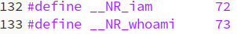

在`include/linux/sys.h`中的系统调用函数表中增加系统调用条目：

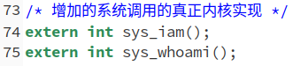

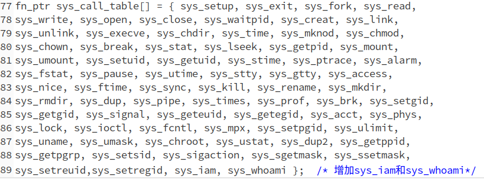

按照实验要求，我们在`kernel`目录中增加`who.c`这个文件，在这个文件里真正实现两个系统调用，为了验证我们前面的修改是否成功，我们先简单的在系统调用中输出一些文字：

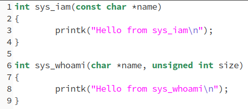

按照指导书中所说修改`kernel`文件夹中的`Makefile`:

* 增加`who.o`这个依赖

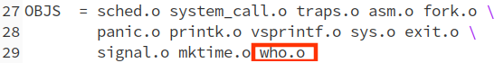

* 在Dependencies中增加对`who.s`和`who.o`的依赖产生条件：

  

然后按照以前的方式`make all`，再执行`./run`进入Linux0.11子系统，在`/usr/include/unistd.h`中增加`iam`和`whoami`的宏定义：

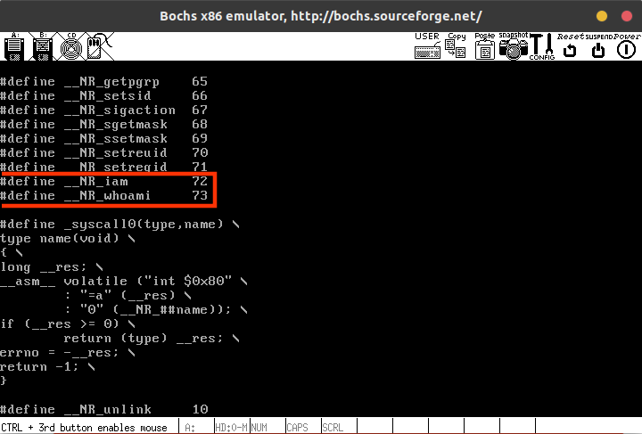

然后可以编写一个测试程序来测试下我们的系统调用是否真的已经添加成功了。我们写一个`hello.c`：

```c
#define __LIBRARY__   /* 必须定义这个宏 */
#include <unistd.h>

/* iam 和 whoami 系统调用的用户接口 */
_syscall1(int, iam, const char*, name);
_syscall2(int, whoami, char*, name, unsigned int, size);

int main(void)
{
    char buf[24];
    iam("test");
    whoami(buf, 24);
    return 0;
}
```

编译执行：

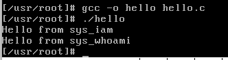

说明我们自己的系统调用已经成功的添加了。

# 实现`iam`和`whoami`系统调用

根据提示，使用`get_fs_byte`和`put_fs_byte`很容易将用户空间中的数据拷贝到内核空间中，编写整个程序的过程中要有这样一个意识：目前我们处于内核空间中，而`name`处于用户空间，任何涉及到取用`name`的操作都需要通过`get_fs_byte`和`put_fs_byte`来进行，不能直接使用用户空间的数据。其他的注意点在代码中都有体现。整个`who.c`实现代码如下：

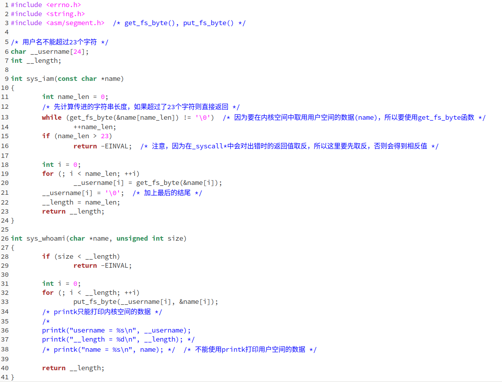

# 测试

在linux0.11子系统中编写`iam.c`和`whoami.c`如下：

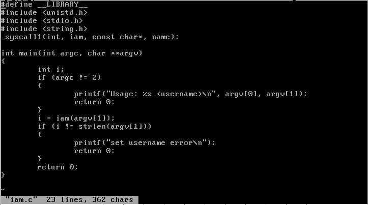

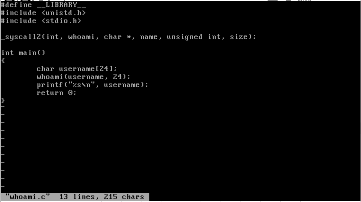

然后编译执行`testlab2.c`，结果如下：

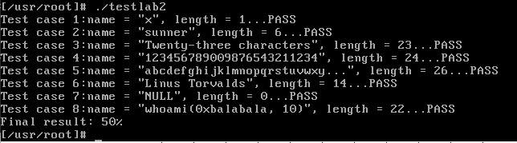

执行testlab2.sh，结果如下：


获得了全部的80%的分数。

# 回答问题

> 从Linux 0.11现在的机制看,它的系统调用最多能传递几个参数?你能想出办法来扩大这个限制吗?

从目前的Linux 0.11的实现机制来看，最多只能传递三个参数，因为内核中只定义了`_syscall1`、`_syscall2`、`_syscall3`三个宏。当然，你可能想到我们可以自己编写更多的传递更多的参数的`_syscall*`，但是由于32位的处理器中只有`eax`、`ebx`、`ecx`、`edx`四个寄存器，其中`eax`用来传递中断号，只有其他三个寄存器能够用来传递参数。因此这种方法并不能真正解决问题。要想解决这个问题，只有改变参数传递的方式，比如参考一般的过程，用栈来传递参数。

> 用文字简要描述向Linux 0.11添加一个系统调用foo()的步骤。

* 在`kernel/system_call.s`中修改系统调用总数
* 然后在`include/unistd.h`中添加`iam`和`whoami`系统调用编号的宏定义
* 在`include/linux/sys.h`中的系统调用函数表中增加系统调用条目
* 最后在内核的某个文件中真正实现这个系统调用