# 编写多进程样本程序

> 基于模板“process.c”编写多进程的样本程序,实现如下功能:
> i. 所有子进程都并行运行,每个子进程的实际运行时间一般不超过30秒;
> ii. 父进程向标准输出打印所有子进程的id,并在所有子进程都退出后才退出;

这里我们主要使用`fork`和`wait`系统调用来完成题目要求：

```c
#include <sys/types.h>
#include <sys/wait.h>
#include <unistd.h>

pid_t fork(void);

pid_t wait(int *wstatus);
```

`fork`函数创建一个子进程。子进程的进程内存空间和父进程中的完全一样，并且从`fork`之后的地方开始执行。`fork`函数在父进程中返回子进程的`pid`，在子进程中返回`0`，出错时返回`-1`，并设置`errno`。

`wait`函数等待当前进程的子进程终止（只要有一个终止，`wait`系统调用就会返回），如果没有子进程终止，则会阻塞。如果成功，返回终止的子进程的`pid`，失败返回`-1`。

详细信息请`man fork`和`man wait`，或者Google。

实现代码如下：

```c
#include <stdio.h>
#include <stdlib.h>
#include <unistd.h>
#include <time.h>
#include <sys/times.h>
#include <sys/types.h>
#include <sys/wait.h>

/* 一个子进程的运行时间(s) */
#define CHILD_RUN_TIME 30
/* 子进程数量 */
#define CHILD_PROCESS_NUM 4

#define HZ	100

void cpuio_bound(int last, int cpu_time, int io_time);

int main(void)
{
	pid_t pid;
	int i = 0;

	while (i < CHILD_PROCESS_NUM)
	{
		if ((pid = fork()) < 0)
		{
			fprintf(stderr, "Error in fork()\n");
			return -1;
		}
		else if (pid == 0)  /* in child */
		{
			/* 子进程执行指定时间后退出 */
			cpuio_bound(CHILD_RUN_TIME, 1, 1);
			exit(0);
		}
		else /* in parent */
		{
			fprintf(stdout, "Process %lu created.\n", (long)(pid));
			++i;
		}
	}

	/* 父进程中一直要等待所有的子进程退出 */
	while ((pid = wait(NULL)) != -1)
	{
		fprintf(stdout, "Process %lu terminated.\n", (long)(pid));
	}
	
	return 0;
}

/*
 * 此函数按照参数占用CPU和I/O时间
 * last: 函数实际占用CPU和I/O的总时间，不含在就绪队列中的时间，>=0是必须的
 * cpu_time: 一次连续占用CPU的时间，>=0是必须的
 * io_time: 一次I/O消耗的时间，>=0是必须的
 * 如果last > cpu_time + io_time，则往复多次占用CPU和I/O
 * 所有时间的单位为秒
 */
void cpuio_bound(int last, int cpu_time, int io_time)
{
	struct tms start_time, current_time;
	clock_t utime, stime;
	int sleep_time;

	while (last > 0)
	{
		/* CPU Burst */
		times(&start_time);
		/* 其实只有t.tms_utime才是真正的CPU时间。但我们是在模拟一个
		 * 只在用户状态运行的CPU大户，就像“for(;;);”。所以把t.tms_stime
		 * 加上很合理。*/
		do
		{
			times(&current_time);
			utime = current_time.tms_utime - start_time.tms_utime;
			stime = current_time.tms_stime - start_time.tms_stime;
		} while ( ( (utime + stime) / HZ )  < cpu_time );
		last -= cpu_time;

		if (last <= 0 )
			break;

		/* IO Burst */
		/* 用sleep(1)模拟1秒钟的I/O操作 */
		sleep_time=0;
		while (sleep_time < io_time)
		{
			sleep(1);
			sleep_time++;
		}
		last -= sleep_time;
	}
}
```

# 实现进程运行轨迹的跟踪

> 在Linux 0.11上实现进程运行轨迹的跟踪。基本任务是在内核中维护一个日志文件/var/process.log,把从操作系统启动到系统关机过程中所有进程的运行轨迹都记录在这一log文件中。

其实这个任务就是要在进程状态发生变化时将状态的变化记录到日志文件中，按照实验手册的指导很容易完成。

先**修改`main.c`中的`main()`函数**，将一下代码从`init`函数中移到`main`中：

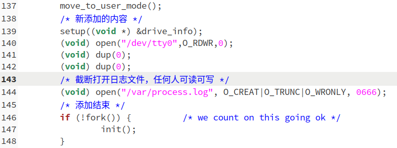

按照实验指导书上所说**在`kernel/printk.c`中添加`fprintk`函数**；

然后就是跟踪进程的运行轨迹了，主要修改以下的文件：

**`kernel/fork.c`中的`copy_process`里两处地方：**

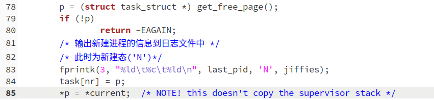

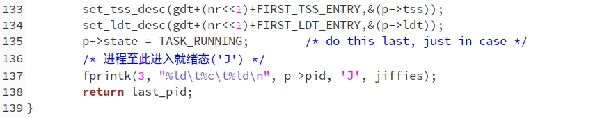

**接下来是`kernel/sched.c`中：**

**`schedule`函数中：**


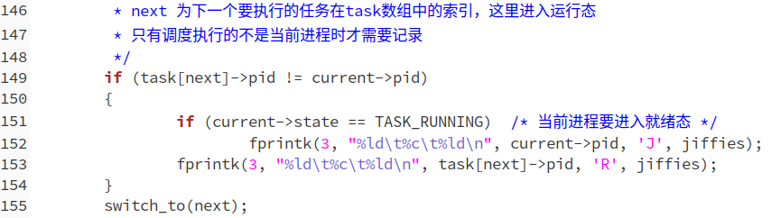

**`sys_pause`函数中：**


**`sleep_on`函数中**：

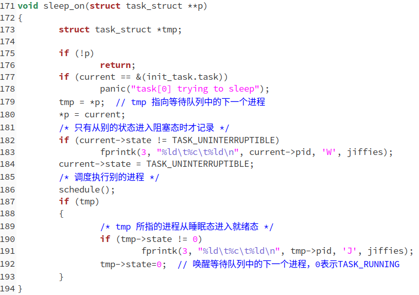

**`interruptible_sleep_on`函数中：**

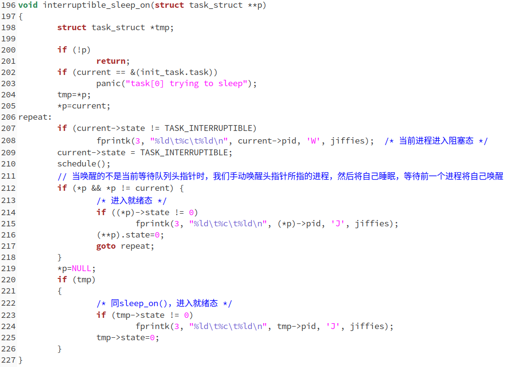

**`wake_up`函数中：**

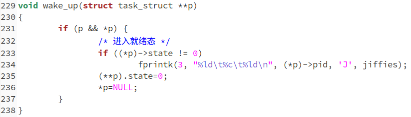

**修改`kernel/exit.c`中的几个函数：**

**`do_exit`函数中：**

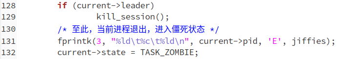

**`sys_waitpid`函数中：**

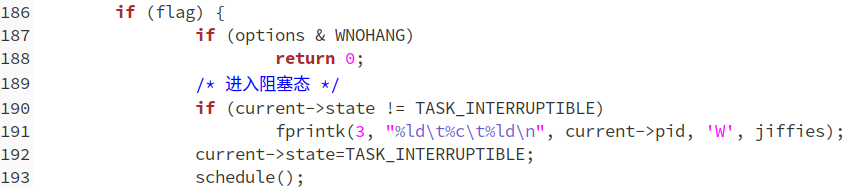

至此，所有的进程状态转移信息我们就已经记录到了日志文件中，不过要注意一点，写入信息是要判断进程状态是否真正的发生了改变。

# 统计进程时间

> 在修改过的0.11上运行样本程序,通过分析log文件,统计该程序建立的所有进程的等待时间、完成时间(周转时间)和运行时间,然后计算平均等待时间,平均完成时间和吞吐量。可以自己编写统计程序,也可以使用python脚本程序——stat_log.py ——进行统计。

我们将上面实现的`process.c`拷贝到Linux 0.11下编译运行，生成日志文件，然后利用`stat_log.py`统计程序运行时间结果如下：

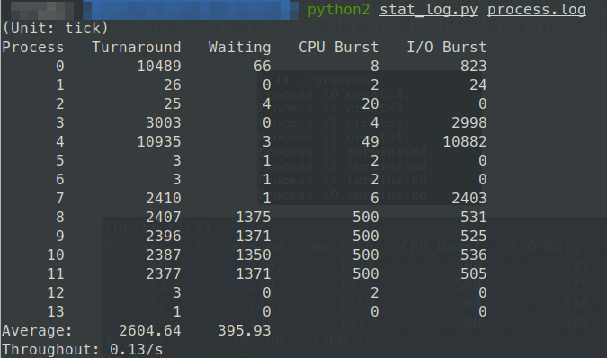

# 修改0.11进程调度的时间片

> 修改0.11进程调度的时间片,然后再运行同样的样本程序,统计同样的时间数据,和原有的情况对比,体会不同时间片带来的差异。

修改时间片有几种方式，可以修改`sched.h`中`#define HZ 100`，这个表示系统时钟滴答的频率。也可以修改指导书中提到的`INIT_TASK`宏。

我们按照指导书中的提示修改`INIT_TASK`宏中的`counter`以增加每个进程的时间片。我这里将`counter`由15改为30，结果如下：

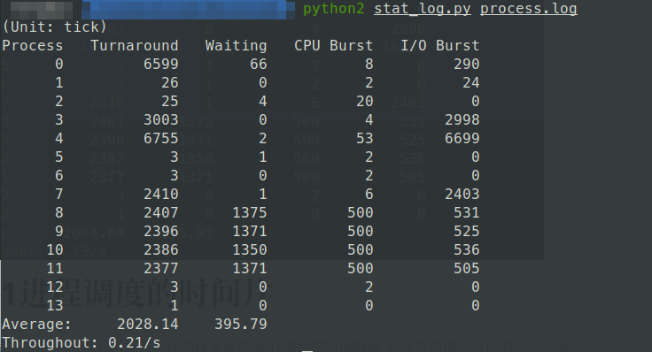

可以发现，由于每个进程能够执行的时间更长了，大部分进程的轮转时间（Turnaround）是降低了的。整体的吞吐量也有提升，但是对于我们的`process.c`这个程序来说，由于是个CPU和I/O任务都很均衡的进程，所以效果不明显。