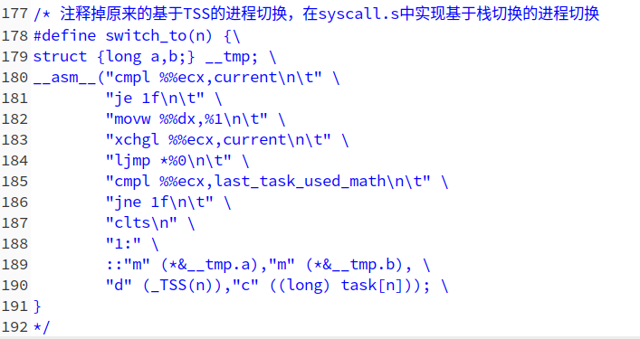
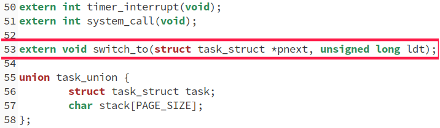
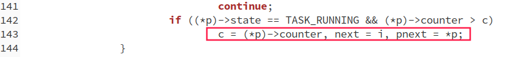
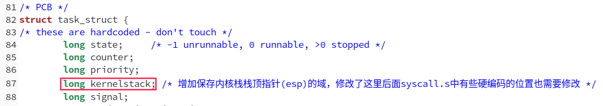
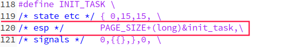
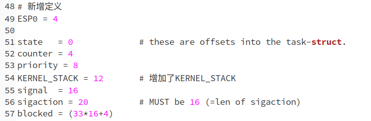
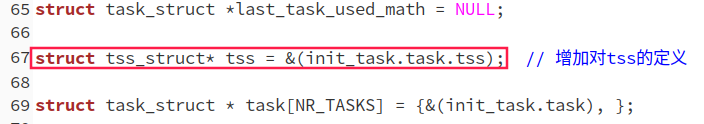

**[注意]**：实验指导书中没有本次试验，但是实验楼中有，因此我将本次实验的实验指导下载下来放在了[这里](./lab_5_guide.pdf)，可以参考一下。

# `shedule`与`switch_to`

先在`sched.h`中注释掉现有的`switch_to`：



在`sched.c`中增加对`switch_to`函数的声明：



修改`schedule`函数：





注意，这里`pnext`必须得赋一个初值。

# 实现`switch_to`

接下来就是真正实现`switch_to`了。在`system_call.s`添加`switch_to`过程的汇编实现。具体原理参考指导书，代码见下，注释已经写的很详细了：

```assembly
.align 2
switch_to:
        pushl %ebp      # 保存调用此函数的函数的栈帧基地址
        movl %esp, %ebp # 当前函数(switch_to)的栈帧基地址为栈顶地址
        pushl %ecx
        pushl %ebx
        pushl %eax      # 以上保存下面用到的几个寄存器
        movl 8(%ebp), %ebx      # 调用switch_to的第一个参数，即pnext——目标进程的PCB
        cmpl %ebx, current      # current为全局变量，指向当前进程的PCB
        je 1f           # 如果要切换到的进程就是目标进程，则不需要做任何操作
        
        # 切换PCB
        movl %ebx, %eax
        xchgl %eax, current     # eax指向当前进程，ebx指向下一个进程，current指向下一个进程
        
        # TSS中的内核栈基地址指针（esp）重写（处理器处理中断时会用到TSS中的内核栈指针来恢复内核栈位置，即设置内核栈的ebp）
        movl tss, %ecx  # tss为全局变量，指向当前进程的tss，以后所有进程都用这个tss，任务切换时不再像以前一样发生变化
        addl $4096, %ebx  # 加上4096是因为如实验指导书所说，内核栈栈底位于PCB所在内存的高地址空间
        movl %ebx, ESP0(%ecx)
        
        # 切换内核栈栈顶指针（切换当前的内核栈为目标内核栈）,即保存当前内核栈用到了哪个位置
        movl %esp, KERNEL_STACK(%eax)  # 保存当前进程内核栈栈顶指针到PCB中，注意，上面已经将eax指向了当前进程的PCB
        movl 8(%ebp), %ebx      # 注意，这里取出的是下一个进程的PCB地址
        movl KERNEL_STACK(%ebx), %esp  # 通过PCB地址可以获得之前保存的内核栈栈顶指针位置
        
        # 切换LDT
        movl 12(%ebp), %ecx
        lldt %cx
        
        movl $0x17, %ecx
        mov %cx, %fs  # 为啥？？目的是修改一下fs的值，会重新加载段寄存器的隐式部分
        cmpl %eax, last_task_used_math
        jne 1f
        clts
1:      popl %eax  # 以下恢复函数开始时保存的寄存器，注意，这里已经切换到了另一个进程的内核栈，所以这些参数进程中开始的时候需要保存下来
        popl %ebx
        popl %ecx
        popl %ebp  # 恢复栈帧基地址
        ret
```

为了完成切换，需要在`shced.h`的PCB定义中增加指向内核栈栈顶指针的域：



由于PCB的结构定义发生了变化，`sched.h`中的`INIT_TASK`宏也要跟着变化：



而且需要在`system_call.s`中定义并修改了几个全局变量：



另外，还得在`sched.c`中增加对全局变量`tss`的定义：




# 修改`fork`

按照指导书，修改如下：

```c
int copy_process(int nr,long ebp,long edi,long esi,long gs,long none,
		long ebx,long ecx,long edx,
		long fs,long es,long ds,
		long eip,long cs,long eflags,long esp,long ss)
{
	struct task_struct *p;
	int i;
	struct file *f;
	long *krnstack;

	p = (struct task_struct *) get_free_page();
	if (!p)
		return -EAGAIN;
	/* 输出新建进程的信息到日志文件中 */
	/* 此时为新建态('N')*/
	fprintk(3, "%ld\t%c\t%ld\n", last_pid, 'N', jiffies);
	
	/* 子进程内核栈位置 */
	krnstack = (long *)(PAGE_SIZE + (long)p);
	/* 设置子进程内核栈 */
	*(--krnstack) = ss & 0xffff;
	*(--krnstack) = esp;
	*(--krnstack) = eflags;
	*(--krnstack) = cs & 0xffff;
	*(--krnstack) = eip;
	/* first_return_from_kernel中会弹出这些值 */
	*(--krnstack) = ds & 0xffff;
    *(--krnstack) = es & 0xffff;
    *(--krnstack) = fs & 0xffff;
    *(--krnstack) = gs & 0xffff;
    *(--krnstack) = esi;
    *(--krnstack) = edi;
    *(--krnstack) = edx;
	/* 当一个新建立的进程被调度执行时在switch_to结束后要执行first_return_from_kernle */
	*(--krnstack) = (long)first_return_from_kernel;
	/* switch_to函数中会使用内核栈中的这些值，所以这里需要在最开始的时候先保存下来 */
	*(--krnstack) = ebp;
	*(--krnstack) = ecx;
	*(--krnstack) = ebx;
	*(--krnstack) = 0;  // 实际上是eax，子进程fork返回值为0，所以这里设置为0
	
	task[nr] = p;
	*p = *current;	/* NOTE! this doesn't copy the supervisor stack */
	
	p->kernelstack = krnstack;  /* 在PCB中设置好内核栈栈顶 */
	
	p->state = TASK_UNINTERRUPTIBLE;
	p->pid = last_pid;
	p->father = current->pid;
	p->counter = p->priority;
	p->signal = 0;
	p->alarm = 0;
	p->leader = 0;		/* process leadership doesn't inherit */
	p->utime = p->stime = 0;
	p->cutime = p->cstime = 0;
	p->start_time = jiffies;
	
	/* 修改TSS的内容全部注释掉*/
	/*
	p->tss.back_link = 0;
	p->tss.esp0 = PAGE_SIZE + (long) p;
	p->tss.ss0 = 0x10;
	p->tss.eip = eip;  // 子进程在被调度时直接跳到父进程中同样的位置开始执行
	p->tss.eflags = eflags;
	p->tss.eax = 0;  // 子进程返回0
	p->tss.ecx = ecx;
	p->tss.edx = edx;
	p->tss.ebx = ebx;
	p->tss.esp = esp;
	p->tss.ebp = ebp;
	p->tss.esi = esi;
	p->tss.edi = edi;
	p->tss.es = es & 0xffff;
	p->tss.cs = cs & 0xffff;
	p->tss.ss = ss & 0xffff;
	p->tss.ds = ds & 0xffff;
	p->tss.fs = fs & 0xffff;
	p->tss.gs = gs & 0xffff;
	p->tss.ldt = _LDT(nr);
	p->tss.trace_bitmap = 0x80000000;
	if (last_task_used_math == current)
		__asm__("clts ; fnsave %0"::"m" (p->tss.i387));
	*/
	if (copy_mem(nr,p)) {
		task[nr] = NULL;
		free_page((long) p);
		return -EAGAIN;
	}
	for (i=0; i<NR_OPEN;i++)
		if ((f=p->filp[i]))
			f->f_count++;
	if (current->pwd)
		current->pwd->i_count++;
	if (current->root)
		current->root->i_count++;
	if (current->executable)
		current->executable->i_count++;
	set_tss_desc(gdt+(nr<<1)+FIRST_TSS_ENTRY,&(p->tss));
	set_ldt_desc(gdt+(nr<<1)+FIRST_LDT_ENTRY,&(p->ldt));
	p->state = TASK_RUNNING;	/* do this last, just in case */
	/* 进程至此进入就绪态('J') */
	fprintk(3, "%ld\t%c\t%ld\n", p->pid, 'J', jiffies);
	return last_pid;  // 父进程中的返回值
}
```

注意入栈顺序。

# 三个问题

1. (1). 为什么要加4096？

   因为`ebx`指向是下个进程的PCB起始地址，而内核栈基地址位于PCB所属那页内存的最高地址，因此加上页大小4096后得到的就是内核栈基地址。

   (2). 为什么没有设置 tss 中的 ss0？

   因为所有的进程可以共用同一个TSS。

2. (1). 子进程第一次执行时, eax= ?为什么要等于这个数?哪里的工作让 eax 等于这样一个数?

   子进程第一次执行时`eax = 0`，来自于这里：`*(--krnstack) = 0;`。之所以让`eax = 0`，是因为子进程的在`fork`后的返回值需要为`0`才能在代码中区分子进程和父进程，即可以使用这样的代码`if (!fork()) {...}`。

   (2). 这段代码中的 ebx 和 ecx 来自哪里,是什么含义,为什么要通过这些代码将其写到子进程的内核栈中?

   `ebx`和`ecx`来自于父进程。存放的是父进程的用户态`ebx`和`ecx`。这样可以保证切换到子进程用户态运行时有和父进程同样的环境。

   (3). 这段代码中的ebp 来自哪里,是什么含义,为什么要做这样的设置?可以不设置吗?为什么?

   `ebp`来自于父进程，保存的是父进程用户栈基地址指针。即在fork刚刚执行完copy_process的时候，它的用户栈是父进程的用户栈，而非自己的用户栈。当子进程进行其他操作时，造成需要的栈将要与父进程不同了，才会创建自己的用户栈。这么做的好处时当一些子进程什么都不做，系统不用分配额外的空间。这就是Copy On Write。

3. 为什么要在切换完 LDT 之后要重新设置 fs=0x17 ?而且为什么重设操作要出现在切换完 LDT 之后,出现在 LDT 之前又会怎么样?

   切换LDT时，会切换进程使用的用户栈。此时，会利用fs查找它指向的描述符表，并且取出隐藏部分：段基址与段限长放在cs。如果查完表不重新赋值，下次查表的时候就还会查这个表，不能起到切换LDT的作用。放在切完LDT是因为，switch_to之后下一个进程可能会查其他表，不在切完LDT的时候赋值就会影响其他表的查找。

# TODO

在修改后的Linux 0.11 中执行上一个实验的`process.c`时终止了一个子进程之后就进入了死循环，暂时还不知道问题出在哪里。