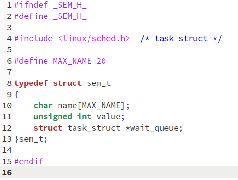
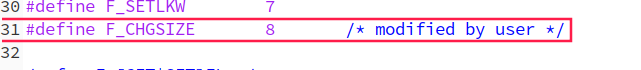
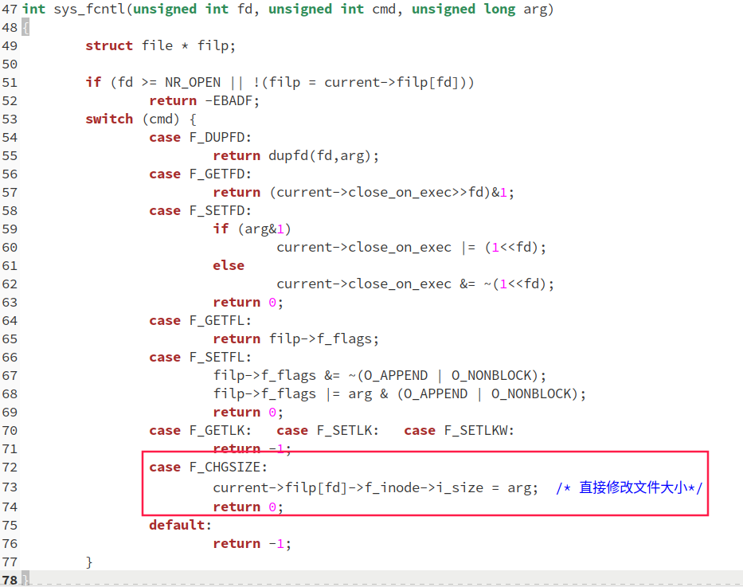
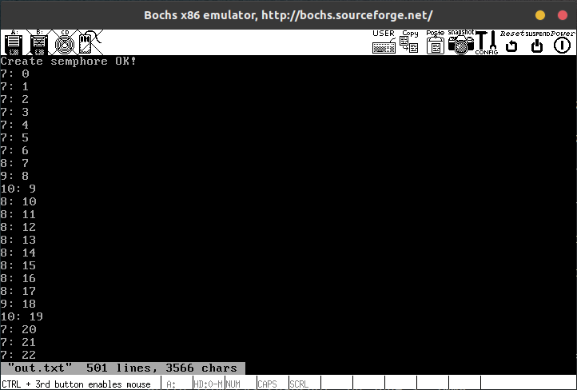
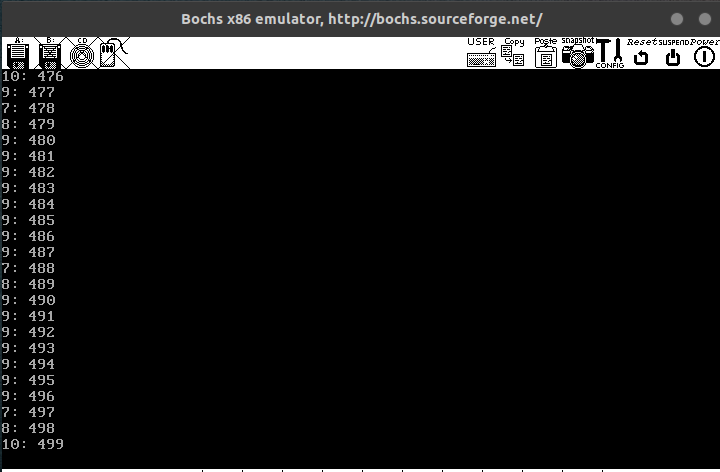

# 在Ubuntu下编写程序,用信号量解决生产者——消费者问题

> 编写`pc.c`。

强烈推荐看看《APUE》这本书。信号量的使用书中都有介绍。具体实现代码如下：

```c
#include <stdio.h>
#include <semaphore.h>
#include <unistd.h>
#include <fcntl.h>
#include <stdlib.h>
#include <sys/wait.h>

#define BUFSIZE 10  /* 缓冲区大小，按照指导书要求设置为10 */

#define CONSUMER_NUM 4  /* 消费者进程数 */

#define MAX_NUM 500

int fd;
sem_t *empty; /* 空槽位的数量 */
sem_t *full; /* 满槽位的数量 */
sem_t *mutex;  /* 控制对文件互斥的访问 */

/**
 * 生产者在文件的最后添加数字
 */
void producer()
{
    int item_num = 0;
    while (item_num < MAX_NUM)
    {
        sem_wait(empty);
        sem_wait(mutex);
        if (lseek(fd, 0, SEEK_END) < 0)
            fprintf(stderr, "Error in producer lseek\n");
        write(fd, &item_num, sizeof(int));
        fsync(fd);
        sem_post(mutex);
        sem_post(full);
        ++item_num;
    }
    close(fd);
}

/**
 * 消费者在文件的开头读取数字，
 * 并且将读取过的数字删除（通过将后面的数字往前移实现）
 */
void consumer()
{
    int item;
    int file_len;
    int tmp_value;
    int j;

    do
    {
        sem_wait(full);
        sem_wait(mutex);
        if (lseek(fd, 0, SEEK_SET) < 0)
            fprintf(stderr, "Error in consumer lseek\n");

        if (read(fd, &item, sizeof(int)) == 0)
        {
            sem_post(mutex);
            sem_post(empty);
            break;
        }

        printf("%d: %d\n", getpid(), item);

        file_len = lseek(fd, 0, SEEK_END); 
        if (file_len < 0)
            fprintf(stderr, "Error when get file length\n");
        /* 通过将后面的数字前移来删除已经读取的数字 */
        /* 这种方式速度特别慢,不知道还有没有别的好办法 */
        for(j = 1; j < (file_len / sizeof(int)); j++) 
        { 
            lseek(fd, j * sizeof(int), SEEK_SET); 
            read(fd, &tmp_value, sizeof(int)); 
            lseek(fd, (j - 1) * sizeof(int), SEEK_SET); 
            write(fd, &tmp_value, sizeof(int)); 
        } 
        ftruncate(fd, file_len - sizeof(int));

        sem_post(mutex);
        sem_post(empty);
    }while(item < MAX_NUM - 1);

    sem_post(full);  /* 当第一个进程退出时通知另外一个阻塞在full上的进程,不然另一个进程永远不会退出了 */

    close(fd);
}

int main()
{
    char empty_name[64];
    char full_name[64];
    char mutex_name[64];
    int i;
    pid_t p_pid;  /* 生产者进程pid */

    /* 确保每个信号量有不同的名字 */
    /* from APUE */
    snprintf(empty_name, 64, "/%ld_empty", (long)getpid());    
    snprintf(full_name, 64, "/%ld_full", (long)getpid());
    snprintf(mutex_name, 64, "/%ld_mutex", (long)getpid());

    fd = open("share.file", O_CREAT | O_RDWR | O_TRUNC, 0666);

    empty = sem_open(empty_name, O_CREAT | O_EXCL, S_IRWXU, BUFSIZE);
    if (empty == SEM_FAILED)
    {
        fprintf(stderr, "Error when create empty\n");
        exit(0);
    }
    full = sem_open(full_name, O_CREAT | O_EXCL, S_IRWXU, 0);
    if (full == SEM_FAILED)
    {
        fprintf(stderr, "Error when create full\n");
        exit(0);
    }
    mutex = sem_open(mutex_name, O_CREAT | O_EXCL, S_IRWXU, 1);
    if (mutex == SEM_FAILED)
    {
        fprintf(stderr, "Error when create mutex\n");
        exit(0);
    }

    printf("Create semphore OK!\n");

    /* 消费者进程 */
    for (i = 0; i < CONSUMER_NUM; ++i)
    {
        if (!fork())
        {
            consumer();
            exit(0);
        }
    }

    /* 生产者进程 */
    if (!fork())
    {
        producer();
        exit(0);
    }
    /* 等待所有子进程结束 */
    while (waitpid(-1, NULL, 0) > 0)
        ;

    sem_close(empty);
    sem_close(full);
    sem_close(mutex);
    close(fd);
    
    return 0;
}
```

注意点在注释中都有体现。

# 在0.11中实现信号量,用生产者—消费者程序检验之

按照[实验二](./lab_2.md)中的步骤添加四个系统调用：

```c
sem_t* sem_open(const char *name, unsigned int value);
int sem_wait(semt_t *sem);
int sem_post(sem_t *sem);
int sem_unlink(const char *name);
```

先在`include/`文件夹中添加`sem.h`头文件，内容如下：



然后在`kernel/`文件夹中添加`sem.c`，内容如下：

```c
#include <sem.h>
#include <string.h> /* strcpy()  strcmp() */
#include <asm/segment.h>  /* get_fs_byte() */
#include <unistd.h>  /* NULL */
#include <asm/system.h>  /* cli()  sti() */
#include <linux/kernel.h>  /* printk() */

#define SEMS_SIZE 5

static sem_t sems[SEMS_SIZE] = {
    {"", 0, NULL},
    {"", 0, NULL},
    {"", 0, NULL},
    {"", 0, NULL},
    {"", 0, NULL},
};

sem_t* sys_sem_open(const char *name, unsigned int value)
{
    if (name == NULL)
    {
        printk("name == NULL\n");
        return NULL;
    }
    int i, index = -1;
    char temp_name[MAX_NAME];
    for (i = 0; i < MAX_NAME; ++i)
    {
        temp_name[i] = get_fs_byte(name+i);
        if (temp_name[i] == '\0')
            break;
    }
    if (i == 0 || i == MAX_NAME)
    {
        printk("name too long or too short, i = %d\n", i);
        return NULL;
    }

    for (i = 0; i < SEMS_SIZE; ++i)
    {
        if (strcmp(sems[i].name, "") == 0)
        {
            index = index == -1 ? i : index;
            continue;
        }
        if (strcmp(sems[i].name, temp_name) == 0)
            return &sems[i];
    }
    sem_t *res = NULL;
    if (index != -1)
    {
        res = &sems[index];
        // printk("before set: name is %s\n", res->name);
        // strcpy(sems[index].name, temp_name);  // 不能使用strcpy，是因为在内核态的原因吗？
        for (i = 0; temp_name[i] != '\0'; ++i)
                sems[index].name[i] = temp_name[i];
        sems[index].name[i] = '\0';
        // printk("after set: name is %s\n", res->name);
        res->value = value;
    }
    else
        printk("no empty slots: index = %d\n", index);
    return res;
}

int sys_sem_wait(sem_t *sem)
{
    if (sem == NULL || sem < sems || sem >= sems + SEMS_SIZE)
        return -1;
    cli();
    while (sem->value == 0)
        sleep_on(&sem->wait_queue);
    sem->value--;
    sti();
    return 0;
}

int sys_sem_post(sem_t *sem)
{    
    if (sem == NULL || sem < sems || sem >= sems + SEMS_SIZE)
        return -1;
    cli();
    wake_up(&sem->wait_queue);
    sem->value++;
    sti();
    return 0;
}

int sys_sem_unlink(const char *name)
{
    if (name == NULL)
        return -1;
    int i; 
    char temp_name[MAX_NAME];
    for (i = 0; i < MAX_NAME; ++i)
    {
        temp_name[i] = get_fs_byte(name+i);
        if (temp_name[i] == '\0')
            break;
    }
    if (i == 0 || i == MAX_NAME)
        return -1;
    temp_name[i] = '\0';

    for (i = 0; i < SEMS_SIZE; ++i)
    {
        if (strcmp(sems[i].name, temp_name))
        {
            sems[i].name[0] = '\0';
            sems[i].value = 0;
            sems[i].wait_queue = NULL;
            return 0;
        }
    }

    return -1;
}
```

**注意，由于在`sys.h`中使用了`sem_t`这个类型，需要`#include <sem.h>`。**

# 用信号量解决生产者—消费者问题

上面的`pc.c`基本上不用做太大的改动即可用于Linux 0.11，注意，Linux 0.11中没有`ftruncate`、`fsync`和`snprintf`，后面两个都有可以凑合用的替代品，但是没有`ftruncate`的替代品，因此，通过修改`fcntl`实现了一个`ftruncate`（此处参考实验楼的[这里](https://www.shiyanlou.com/courses/reports/373603/))。先修改`fcntl.h`，增加一个宏定义：



然后修改`fcntl.c`如下：



然后重新编译内核即可。

最后在Linux 0.11中的`pc.c`如下：

```c
#define __LIBRARY__

#include <stdio.h>
#include <sem.h>
#include <unistd.h>
#include <fcntl.h>
#include <stdlib.h>
#include <sys/wait.h>

_syscall2(sem_t*, sem_open, const char*, name, unsigned int, value);
_syscall1(int, sem_wait, sem_t*, sem);
_syscall1(int, sem_post, sem_t*, sem);
_syscall1(int, sem_unlink, const char*, name);

#define BUFSIZE 10  

#define CONSUMER_NUM 4  

#define MAX_NUM 500

int fd;
sem_t *empty; 
sem_t *full; 
sem_t *mutex;  

int ftruncate(int fd, unsigned long size)
{
    return fcntl(fd, F_CHGSIZE, size);
}

void producer()
{
    int item_num = 0;
    while (item_num < MAX_NUM)
    {
        sem_wait(empty);
        sem_wait(mutex);
        if (lseek(fd, 0, SEEK_END) < 0)
            fprintf(stderr, "Error in producer lseek\n");
        write(fd, &item_num, sizeof(int));
        sync();
        sem_post(mutex);
        sem_post(full);
        ++item_num;
    }
    close(fd);
}

void consumer()
{
    int item;
    int file_len;
    int tmp_value;
    int j;

    do
    {
        sem_wait(full);
        sem_wait(mutex);
        if (lseek(fd, 0, SEEK_SET) < 0)
            fprintf(stderr, "Error in consumer lseek\n");

        if (read(fd, &item, sizeof(int)) == 0)
        {
            sem_post(mutex);
            sem_post(empty);
            break;
        }

        printf("%d: %d\n", getpid(), item);
        fflush(stdout);

        file_len = lseek(fd, 0, SEEK_END); 
        if (file_len < 0)
            fprintf(stderr, "Error when get file length\n");
        for(j = 1; j < (file_len / sizeof(int)); j++) 
        { 
            lseek(fd, j * sizeof(int), SEEK_SET); 
            read(fd, &tmp_value, sizeof(int)); 
            lseek(fd, (j - 1) * sizeof(int), SEEK_SET); 
            write(fd, &tmp_value, sizeof(int)); 
        } 
        ftruncate(fd, file_len - sizeof(int)); 

        sem_post(mutex);
        sem_post(empty);
    }while(item < MAX_NUM - 1);
    sem_post(full);
    close(fd);
}

int main()
{
    char empty_name[20];
    char full_name[20];
    char mutex_name[20];
    int i;
    pid_t p_pid;  

    /* from APUE */
    sprintf(empty_name, "/%ld_empty", (long)getpid());    
    sprintf(full_name, "/%ld_full", (long)getpid());
    sprintf(mutex_name, "/%ld_mutex", (long)getpid());

    fd = open("share.file", O_CREAT | O_RDWR | O_TRUNC, 0666);

    empty = sem_open(empty_name, BUFSIZE);
    if (empty == NULL)
    {
        fprintf(stderr, "Error when create empty\n");
        exit(0);
    }
    full = sem_open(full_name, 0);
    if (full == NULL)
    {
        fprintf(stderr, "Error when create full\n");
        exit(0);
    }
    mutex = sem_open(mutex_name, 1);
    if (mutex == NULL)
    {
        fprintf(stderr, "Error when create mutex\n");
        exit(0);
    }

    printf("Create semphore OK!\n");

    for (i = 0; i < CONSUMER_NUM; ++i)
    {
        if (!fork())
        {
            consumer();
            exit(0);
        }
    }

    if (!fork())
    {
        producer();
        exit(0);
    }
    while (waitpid(-1, NULL, 0) > 0)
        ;

    sem_unlink(empty_name);
    sem_unlink(full_name);
    sem_unlink(mutex_name);
    close(fd);
    
    return 0;
}
```

~~但是在这个文件中存在一个BUG？执行`pc`时会产生大量乱七八糟的输出，Bochs直接就死机了。。也不知道为啥，欢迎知道的同学告诉我哈。。(已经解决，是之前的信号量实现问题。)~~

将实验结果输出到文件中，执行以下命令：


等待执行完毕后打开out.txt内容如下：





试验完成。

# 实验问答

> 在pc.c中去掉所有与信号量有关的代码,再运行程序,执行效果有变化吗?为什么会这样?

很明显，去掉进程同步结构，会造成输出混乱。因为无法保证按顺序取数据，写数据时机也不能保证。

> 实验的设计者在第一次编写生产者——消费者程序的时候,是这么做的......可行吗？

显然不可行，有造成死锁的可能。不能先对Mutex加锁再对Empty加锁。