# 跟踪Linux 0.11地址翻译过程

> 用Bochs调试工具跟踪Linux 0.11的地址翻译（地址映射）过程，了解IA-32和Linux 0.11的内存管理机制。
>
> 以汇编级调试的方式启动bochs，引导Linux 0.11，在0.11下编译和运行test.c。它是一个无限循环的程序，永远不会主动退出。然后在调试器中通过查看各项系统参数，从逻辑地址、LDT表、GDT表、线性地址到页表，计算出变量i的物理地址。最后通过直接修改物理内存的方式让test.c退出运行。

首先看看`test.c`的代码：

```c
#include <stdio.h>
int i = 0x12345678;
int main(void)
{
    printf("The logical/virtual address of i is 0x%08x", &i);
    fflush(stdout);
    while (i)
    	;
    return 0;
}
```

在Linux 0.11下跑跑看：

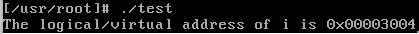

打印出了`i`这个变量的逻辑地址，然后就陷入死循环了。接下来我们要做的就是通过Bochs调试器修改`i`的值，让循环能够退出，也就是将`i`修改为0。

## 地址翻译过程

由于Bochs中我们看到的都是物理地址，我们需要通过`i`的逻辑地址计算出物理地址。我们先来总结一下通过逻辑地址找到真实物理地址的过程：

由于分段机制的存在，我们看到的这个逻辑地址(`0x00003004`)只是段内偏移而已，要找到真实的虚拟地址，我们还需要根据段寄存器找到段基址。

**具体的操作过程如下：**

1. `ds`、`fs`等段寄存器中保存的是段基址在LDT(局部描述符表)中的偏移，也就是说LDT[ds]就是真正的段基址，那么问题就是如何找到LDT的基址？
2. `ldtr`寄存器保存的是当前进程的LDT基址在GDT(全局描述符表)中的偏移，也就是说GDT[ldtr]中就是LDT的基址，那么如何找到GDT的基址呢？`gdtr`寄存器中保存的就是GDT的基址。

综上说述，用一种比较好理解的方式来说就是 真正的虚拟地址=gdtr\[ldtr\]\[ds\] + 段内偏移。接下来就实际操作一下来找到`i`的真正虚拟地址。

## 计算虚拟地址

首先按照实验指导书上写的一通操作将Bochs停在`while`循环里面：

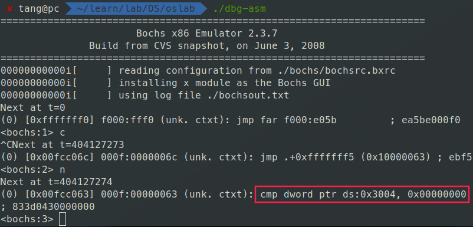

看到，“刚好”停在判断语句上。另外我们还注意到用到的段基址寄存器是`ds`。接下来我们用`sreg`命令查看一下各个寄存器的值：

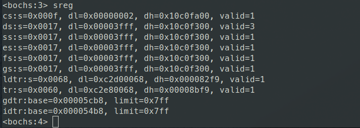

观察一下我们所关心的几个寄存器的值：`ds`寄存器的值是`0x0017`，`ldtr`的值是`0x0068`，`gdtr`的值是`0x00005cb8`。也就是说GDT表的基址是`0x00005cb8`，而LDT表的基址放在GDT表中的偏移为`0x0068=0000000001101000`(二进制)。由于段选择子（我们提到的段寄存器包括`ds`、`ldtr`都是段选择子）有自己的特定格式，这不是真正的偏移量，那么真正的偏移是多少呢？接下来就要提到段选择子的格式了：


只有前面的13位才是真正的索引号，也就是偏移量。RPL是请求特权级，当访问一个段时，处理器要检查RPL和CPL（放在cs的位0和位1中，用来表示当前代码的特权级），即使程序有足够的特权级（CPL）来访问一个段，但如果RPL（如放在ds中，表示请求数据段）的特权级不足，则仍然不能访问，即如果RPL的数值大于CPL（数值越大，权限越小），则用RPL的值覆盖CPL的值。而段选择子中的TI是表指示标记，如果TI=0，则表示段描述符（段的详细信息）在GDT（全局描述符表）中，即去GDT中去查；而TI=1，则去LDT（局部描述符表）中去查。**那么真正的偏移量就应该是1101(二进制)=13(十进制)**。也就是说LDT的基址是GDT表中的第14项（下标从0开始）。

我们已经知道了GDT表的基址是`0x00005cb8`，LDT表的基址在GDT表中，偏移量为13。接下来查看一下下标为13处的值：使用`xp /2w 0x00005cb8+13*8`查看以8字节单位，下标为13处的值：

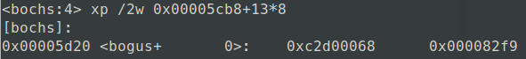

可以看到，确实和`ldtr`所在行中`dl`和`dh`的值相同。这就是LDT的物理地址，但是我们还需要根据特定的格式将这两个数字组合起来。接下来我们看看段描述符的格式：

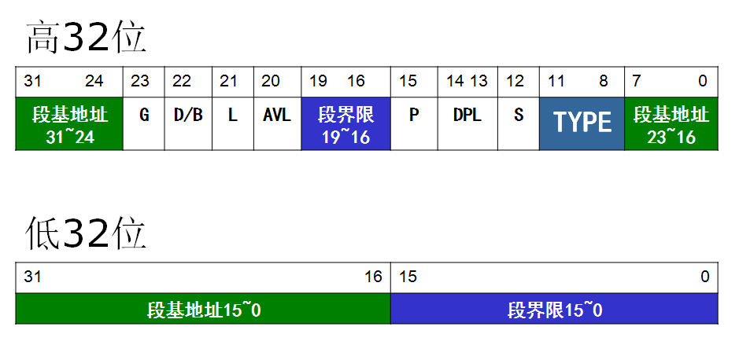

这里，低32位就是`dl=0xc2d00068`，高32位就是`dh=0x000082f9`。根据描述符的格式，将段基址组合起来得到`0x00f9c2d0`。这就是LDT的真正物理地址了。

有了LDT的基址，又有了`ds=0x0017`这个偏移，接下来就能得到`i`的真正虚拟地址了。`ds`是个段选择子，根据段选择子的格式，我们可以算出`ds`对应的偏移为`0x0017=0000000000010111`，其中RPL=11，索引为10(二进制)=2(十进制)，表示查找的是LDT中第三个段描述符（从0开始编号）。接下来查看一下LDT中的第三项：

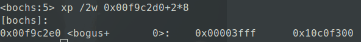

结果是`0x00003fff`和`0x10c0f300`。同样，我们按照上面的段描述符的格式将其组合起来得到`0x10000000`，这就是`i`的段基址了。**将它和段偏移`0x3004`组合起来得到`0x10003004`，这就是`i`的真正虚拟地址了。**用`calc ds:0x3004`可以验证这个结果：

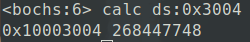

## 计算物理地址

有了虚拟地址，接下来就是查询页表得到真正的物理地址了。在Linux 0.11中采用的是一个二级页表的结构。将线性地址分为页目录号、页表号和页内偏移，图示如下：

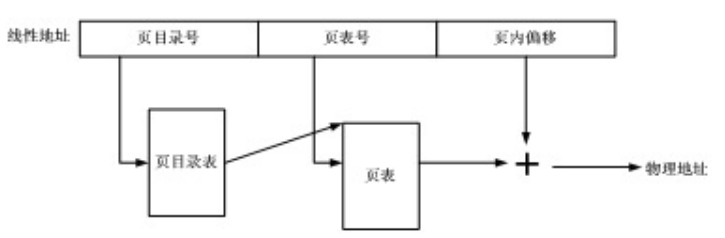

它们分别对应了32位线性地址的10位+10位+12位。所以，虚拟地址`0x10003004`对应的页目录号是64，页表号为3，页内偏移是4。

在IA-32下，页目录表的基址有`CR3`寄存器给出，`creg`命令能够查看：

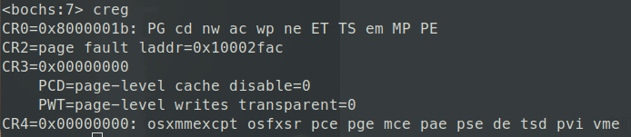

`CR3=0x00000000`，说明页目录表的基址为0。页目录表中以4字节为单位，查看页目录表中下标为64的位置处的值：

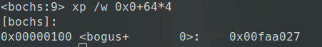

看到值为`0x00faa027`。页表的基址就隐藏在这4字节的数字中。这32位中前20位为物理地址，后面是一些属性信息。因此，`0x00faa027`所代表的物理地址就是`0x00faa`，也即页表的基地址为`0x00faa000`。接下来从这个位置查找页表中下标为3的页表项：

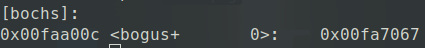

说明真实的页框的基址就是`0x00fa7`，后面的是一些属性信息。我们把页框的基址和业内偏移`0x004`组合到一起，**得到`0x00fa7004`，这就是`i`的物理地址了。**

通过指导书上的命令来验证：

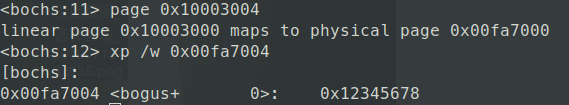

完全正确！

接下来通过直接修改内存来改变`i`的值，使其值为0来退出循环。命令是`setpmem 0x00fa4004 4 0`，表示从0x00fa7004地址开始的4个字节都设为0。然后再用“c”命令继续Bochs的运行，可以看到test退出了，说明i的修改成功了，此项实验结束。