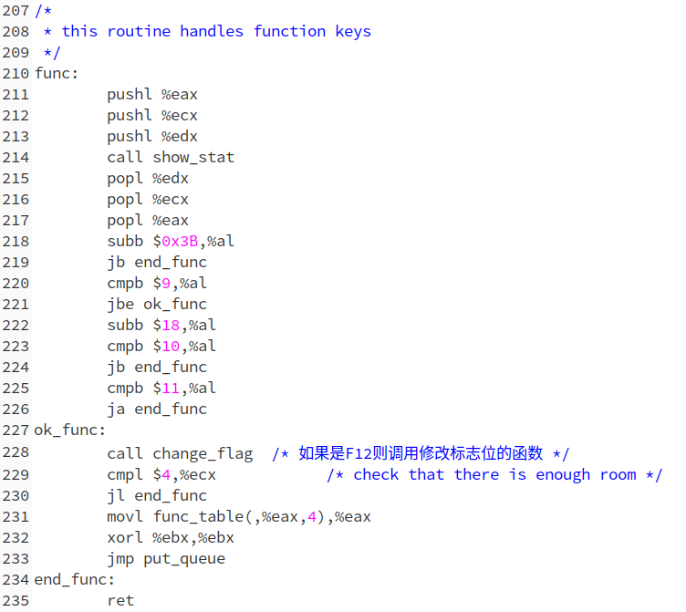
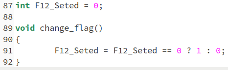
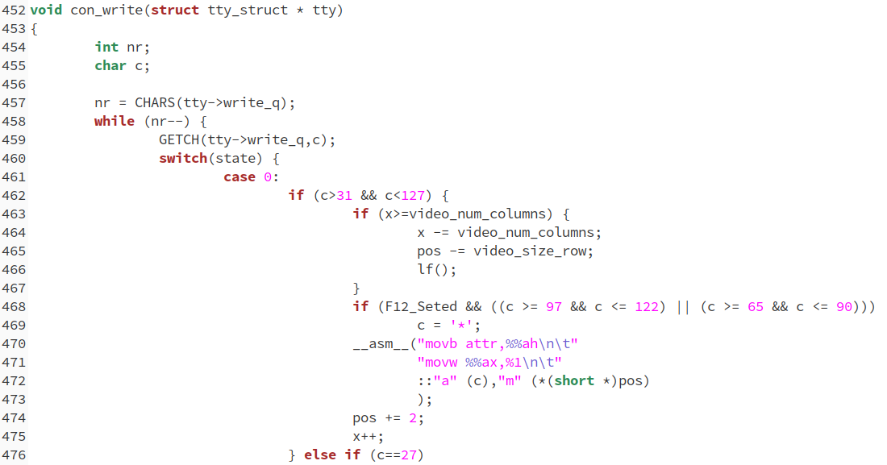
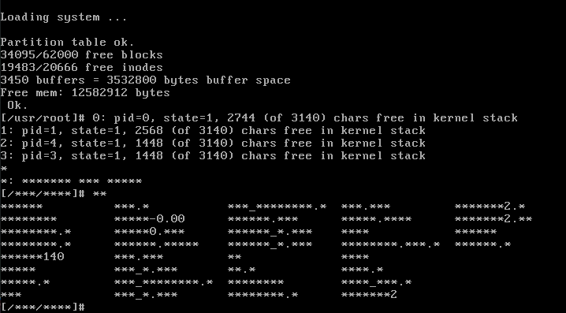

# 修改代码，实现按下F12之后替换字母

很明显，我们得找到按下F12之后调用的是哪个过程，通过查看《注释》，在`keyboard.S`中找到下面的位置：

代码的注释中也提到这个函数是功能键按下后调用的函数。因此在这里我们加上自己的函数调用代码，也就是`change_flag`这个函数。这个函数我们在`console.c`中定义如下：

也非常简单。然后我们在`con_write`函数中判断F12是否按下，如果按下就将回显字符设置为`*`，代码如下：

注意，我们只将字母替换为了`*`。

实验结果：

按下之前：

按下F12之后：

可以看到所有的输出字母都变成了星号。

可能又得同学注意到了，除了星号，还输出了一段进程信息，包括pid，state等。这就是F12默认的作用。

# 回答问题

1.  在原始代码中，按下F12，中断响应后，中断服务程序会调用func？它实现的是什么功能？

答：上面已经提到，原始的F12的功能是打印出进程状态信息。

2.  在你的实现中，是否把向文件输出的字符也过滤了？如果是，那么怎么能只过滤向终端输出的字符？如果不是，那么怎么能把向文件输出的字符也一并进行过滤？

答：没有过滤掉向文件输出的字符，因为只修改了`con_write`函数。向文件中输出字符调用的是`file_dev`中的`file_write`函数来实现的。因此，如果要修改像文件中输出的字符，就可以修改这个`file_write`函数。或者在上层往缓冲区队列放入字符的时候就将字符替换成星号。